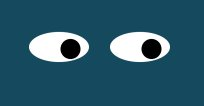

### Eye Exercise

Transforms 2 *div* elements using the mouse coordinates (onmousemove) to display 2 moving eyes that follow the cursor.

### RoadMap

Since I have not done anything **extra** or special to this particular exercise I plan on doing a cross-eye effect. When the cursor is moved between the two eyes. I hope to get the time before submitting my *GitHub Pages Portfolio Assignment*

### License information
Most code obtained from MIT. Minor adjustments and additions by Ramon C